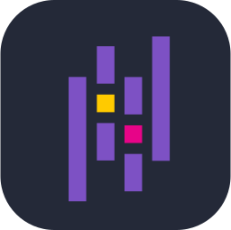

<h1 align="center">
  Hello world!
  
</h1>

  

  
  
  

### :man_technologist: &nbsp;About Me:

I am a `BackEnd` oriented `FullStack Engineer`

-   🔭 Currently working on different freelance projects and looking for new opportunities.
-   👨‍💻 Turning caffeine into code (and sometimes bugs 🐛).
-   🎤 Karaoke enthusiast, even when debugging
-   🖥️ Passionate about clean code and creative solutions ✨
-   ⚡ In my free time I solve problems on PyGen and read tech articles.

---

### :hammer_and_wrench: &nbsp;Skills:

-   Languages:

## 

-   Frameworks:

## 

-   Package managers:

## 

-   Databases:

## 

-   Version control:

## 

-   CI/CD:

## 

-   Technologies:
    

## 

-   Editors:

## 

-   Graphic:

## 

-   OS:

## 

### :bar_chart:  &nbsp;Stats:
